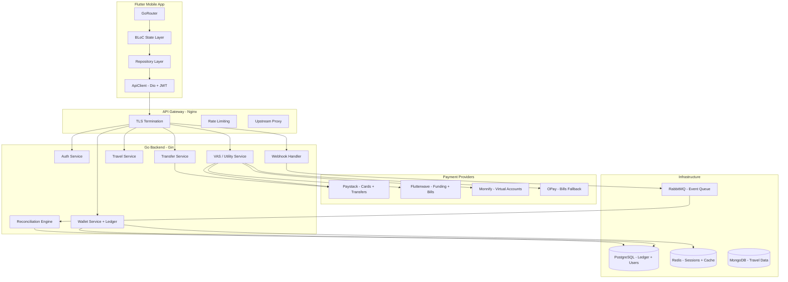
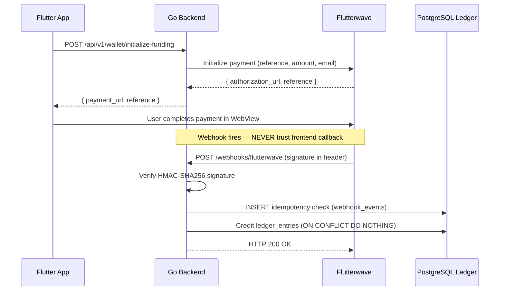

# Flip Bills — System Architecture

## Overview

Flip Bills is a production-grade Flutter + Go fintech super-app for the Nigerian market.
It supports wallet management, VAS (airtime, data, electricity, TV/Cable, betting), travel booking, P2P/bank transfers, and a double-entry ledger accounting engine.

---

## High-Level Architecture



---

## Payment Flow — Wallet Funding



---

## Double-Entry Ledger Rules

| Rule | Implementation |
|---|---|
| **Balance computation** | `SELECT SUM(credit) - SUM(debit) FROM ledger_entries WHERE wallet_id = ?` |
| **No mutable balance column** | The `wallets` table has no `balance` field — balance is always computed |
| **Idempotency** | `UNIQUE(reference)` + `ON CONFLICT DO NOTHING` prevents double-credits |
| **Atomic debit** | Row-level `FOR UPDATE` lock prevents overdrafts in concurrent scenarios |
| **Audit trail** | Every kobo movement has a timestamped, immutable ledger entry |

---

## Provider Routing Strategy

```
Feature        Primary      Fallback 1    Fallback 2
──────────     ─────────    ──────────    ──────────
Card payments  Paystack     Flutterwave   Monnify
VAS bills      OPay         Flutterwave   Monnify
Bank transfers Paystack     Flutterwave   —
Virtual accts  Monnify      Paystack      —
```

Circuit breaker opens after **3 consecutive failures** and auto-resets after **60 seconds**.

---

## Database Schema Overview

```
users              — Registration, KYC, PIN
wallets            — One per user (no balance column)
ledger_entries     — Double-entry accounting (SUM gives balance)
transfers          — Outbound transfer lifecycle
virtual_accounts   — Monnify/Paystack dedicated virtual accounts
webhook_events     — Immutable audit log for all inbound webhooks
otp_codes          — SMS OTP lifecycle
travel_bookings    — Bus + flight bookings
loyalty_points     — Points earned per transaction
dispatcher_events  — Travel operator event log
```

---

## Deployment Architecture

```
Internet
    │
    ▼
Cloudflare (CDN + DDoS protection)
    │
    ▼
Nginx (TLS termination, rate limiting)
    │
    ▼
Railway / Fly.io (Go API, 3 instances)
    │
    ├── Railway PostgreSQL (production database)
    ├── Railway Redis (caching + sessions)
    ├── Railway MongoDB (travel partner data)
    └── CloudAMQP (managed RabbitMQ, free tier)
```

---

## Cost Optimization (Startup Phase)

| Service | Provider | Monthly Cost |
|---|---|---|
| API Hosting | Railway Starter | ~$5 |
| PostgreSQL | Railway | ~$5 |
| Redis | Railway | ~$3 |
| MongoDB | MongoDB Atlas Free | $0 |
| RabbitMQ | CloudAMQP Little Lemur | $0 |
| CDN | Cloudflare Free | $0 |
| SMS (OTP) | Termii | Pay-as-you-go |
| Payments | Paystack / Flutterwave | 1.5% per txn |
| **Total infra** | | **~$13/month** |

Scale to Kubernetes (GKE Autopilot) when monthly active users exceed 50,000.

---

## Security Checklist

- [x] JWT access tokens (15min TTL) + refresh tokens (30 days)
- [x] Refresh token rotation on every use
- [x] Webhook HMAC signature verification (Paystack SHA-512, Flutterwave SHA-256)
- [x] Idempotency keys on all payment operations
- [x] Redis rate limiting (100 req/min per IP)
- [x] Biometric confirmation before transfers
- [x] OTP verification on registration + sensitive actions
- [ ] BVN/NIN verification (add when reaching 10k users)
- [ ] 2FA via TOTP (Phase 3)
- [ ] Transaction limits enforcement (Phase 3)
